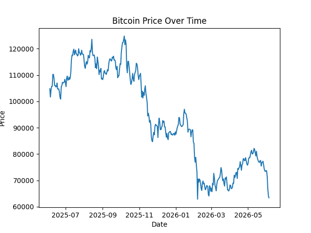
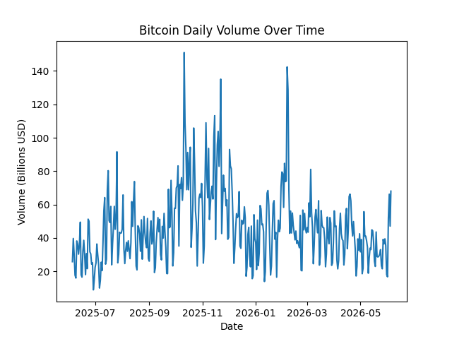
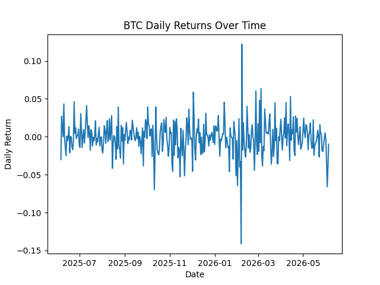
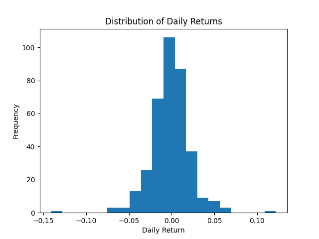
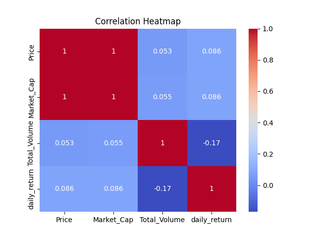
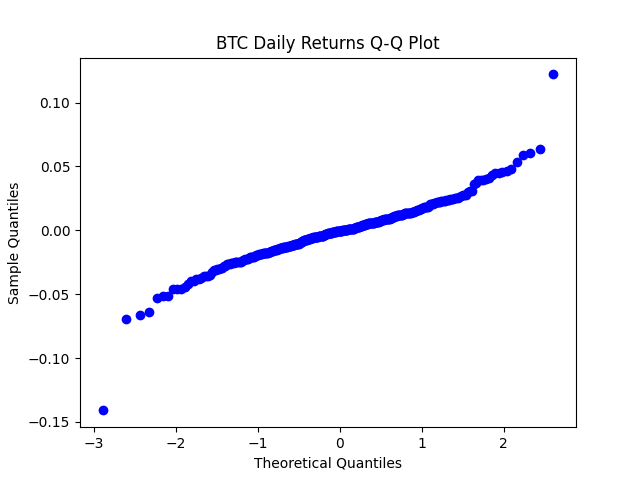

# BTC Market Intelligence Report

## Dataset Overview

For this report based on the yearly overall performance of Bitcoin, I have gathered information such as marketcaps, dates, prices, daily returns, and volume from CoinGecko.
It contains information dating from June 2025 to June 2026, formed by 5 columns which contain the aspects mentioned earlier and 366 rows from each date.
Fortunately, no nulls or quality issues were found. 
> Note: open this file in Markdown Preview (`Ctrl+Shift+V`) to render the chart images.

                                                    Key Statistics
The average price of bitcoin from June 2025 to June 2026 was 93,847.76$, which wasnt a really strong point to either sell or invest, since we had a historic maximum of 124.773,50$ on october 7 2025 and shortly after stabilizing in the 90's, crashed all the way down to a price range between the 60's, which interestingly enough, is actually close to the minimum we had over this one year period, where bitcoin hit a minimum of  62.853,69$ in February 6 2026.
I found an average daily volatility of 2.2%, which is pretty high as it is expected with cryptos.
The worst day was also on February 2026 with a price of 62.853,69$ and a daily return of -14.1% and the best day was actually next day, where it bounced back to 70.523$ with a daily return of 12.2%
Daily average volume was 46.9 Billion USD.

## Findings
I found a perfect 1-1 realation between marketcap and price as it was expected.
There is a negative correlation of 17% between volume and daily return, which is interesting to see, since we can notice that
usually when there are massive bull runs, it ends up bouncing back to lower levels than before.
Homoscedasticity is not met, this means this model is hetereoscedastic, which is unfortunate because it means that the price changes are pretty much random and volatility is not constant, so its not really up to standards for a Machine Learning predictive model.
BTC daily returns show negative skewness (-0.24), meaning extreme negative days are more severe than extreme positive days, as confirmed by the worst day (-14.1%) being more extreme than the best day (+12.2%).

## Visualizations
Below are the key charts used for this exploratory analysis. Each image is loaded from `../data/processed` relative to this notebook.

Bitcoin has a noticeable trend where it goes down, bounces back up but not enough to recover its last price, and then it repeats the same cycle until its price became half of what it used to be one year ago.

Bitcoins volume seems highly volatile, with a tendency to bounce back further down than it goes up when it peaks.

Again, it seems highly volatile, BUT, it usually does come up with high peaks. Personally i would consider dollar cost averaging, since even though it is volatile and tends to go down after a peak, it shows a lot of consistency towards a tendency to show peaks.

Distribution is approximately bell-shaped but shows negative skewness (-0.24), with a longer left tail indicating more extreme negative days.

The independent variables, except marketcap are showing a weak relation between them. This would make for a good ML model where we dispose of marketcap, since it has its own formula.

The data shows a very linear pattern in the middle with some heavy tails, so its almost normal.
